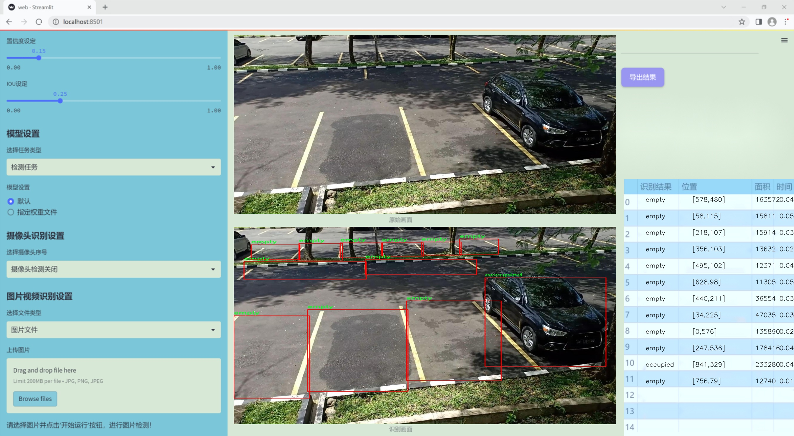
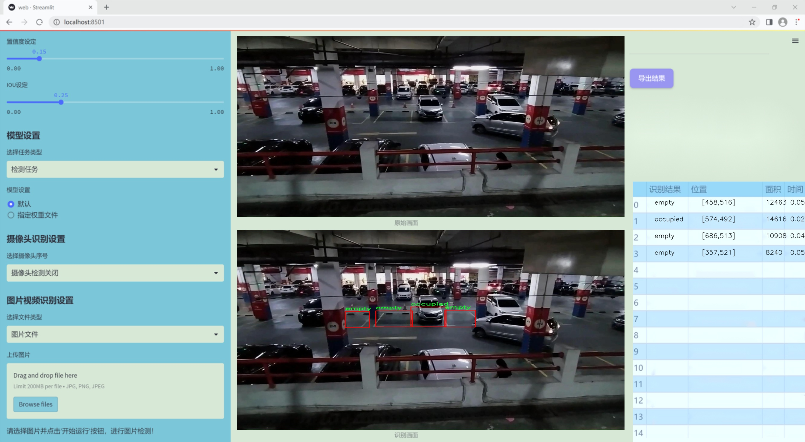
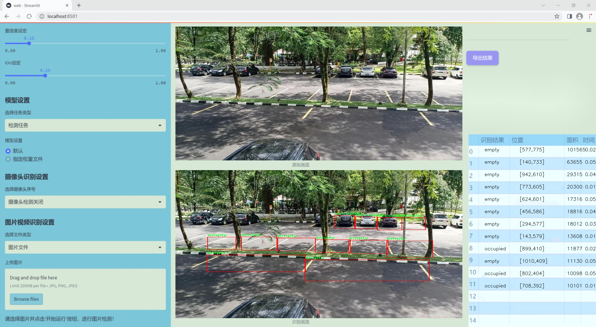
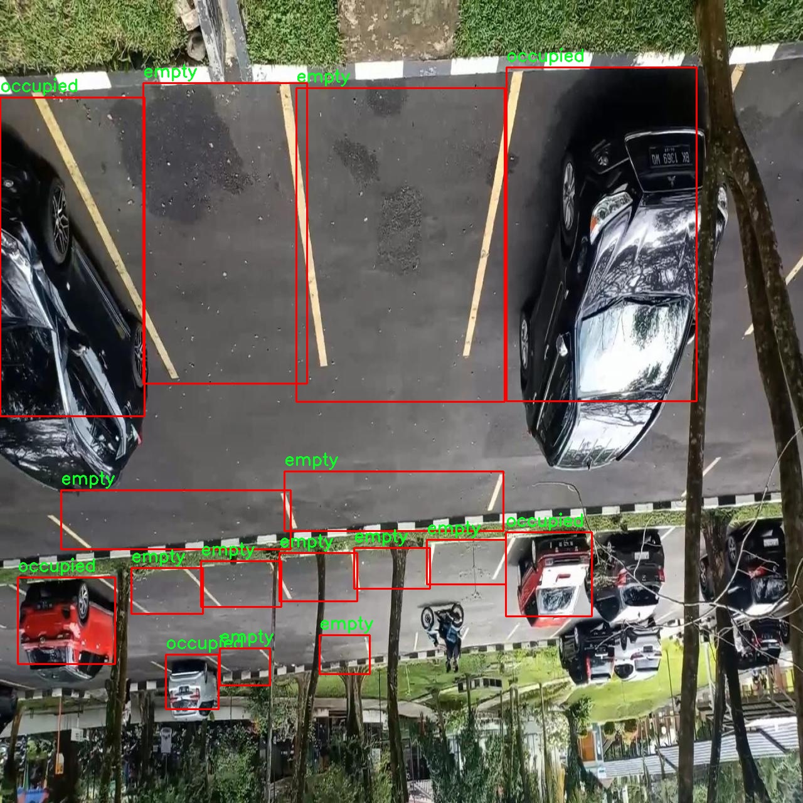
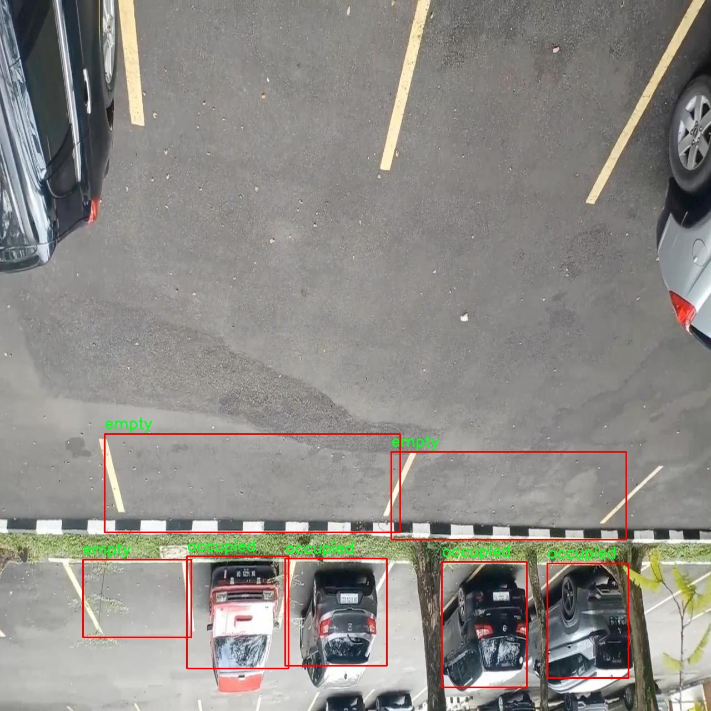
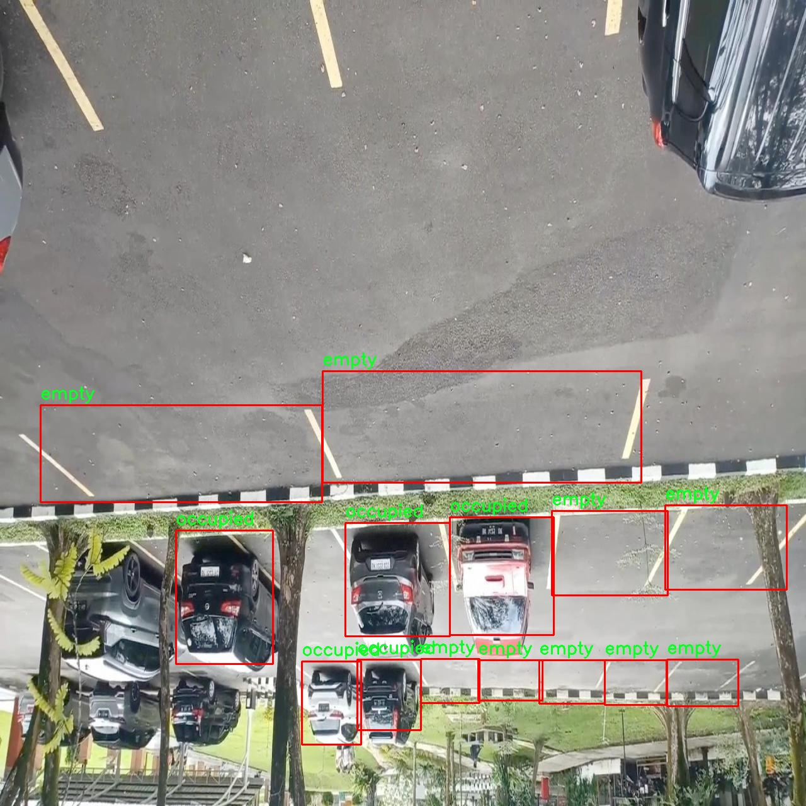
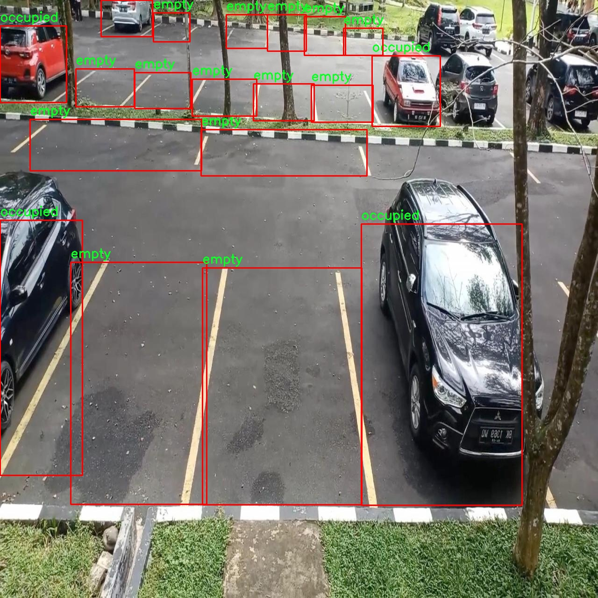
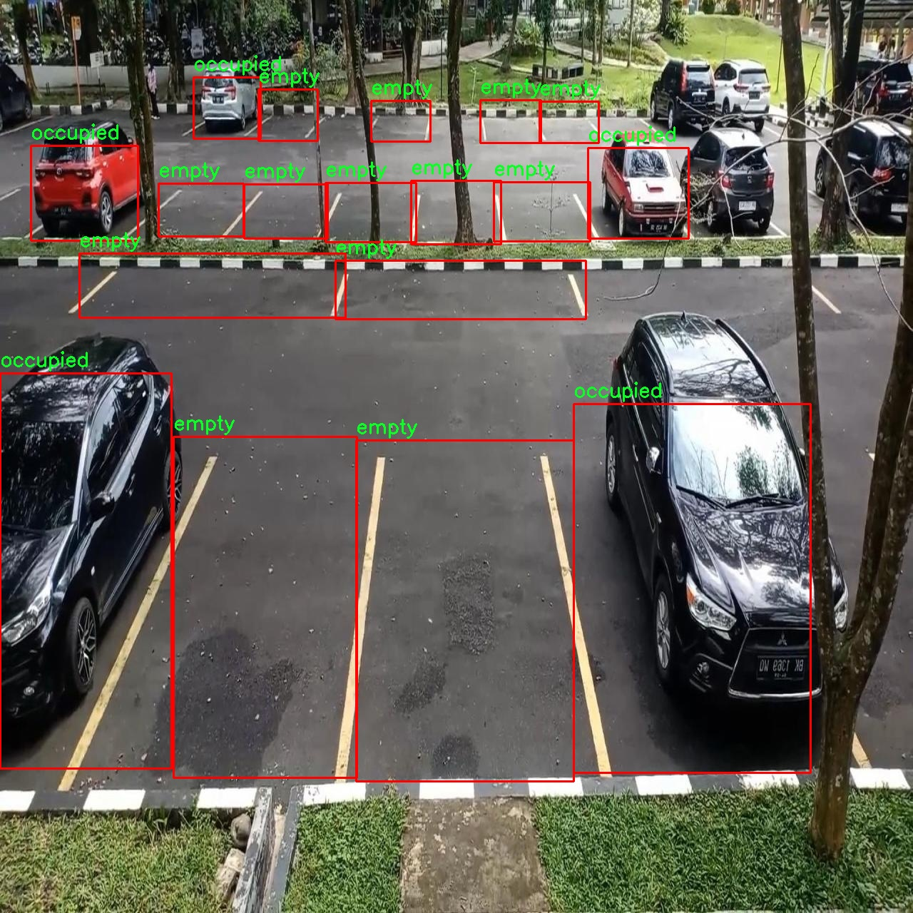

### 1.背景意义

研究背景与意义

随着城市化进程的加快，城市交通拥堵问题日益严重，停车难成为了许多城市居民面临的普遍问题。有效的停车管理不仅可以提高城市交通的流动性，还能减少因寻找停车位而造成的时间浪费和环境污染。因此，开发一个高效的停车位状态检测系统显得尤为重要。基于深度学习的计算机视觉技术，尤其是目标检测算法，已被广泛应用于智能交通系统中，为停车位的自动检测提供了新的解决方案。

YOLO（You Only Look Once）系列算法因其实时性和高准确率而受到广泛关注。YOLOv11作为该系列的最新版本，结合了多种先进的技术，能够在复杂环境中快速准确地识别目标。通过对YOLOv11的改进，我们可以进一步提升其在停车位状态检测中的性能。具体而言，改进后的模型将能够更好地处理不同光照条件、天气变化以及复杂背景下的停车位检测任务。

本研究将利用一个包含1100张图像的数据集，数据集中分为“空闲”和“占用”两类，旨在训练一个高效的停车位状态检测模型。通过对数据集的深度分析和处理，我们将为模型提供丰富的训练样本，以提升其泛化能力和准确性。此外，数据集的图像经过预处理，确保了输入数据的一致性和质量，为模型的训练打下了坚实的基础。

综上所述，基于改进YOLOv11的停车位状态检测系统不仅能够有效解决城市停车难题，还将为智能交通管理提供有力支持。通过本研究的实施，我们希望能够为未来的智能城市建设贡献一份力量，推动交通管理的智能化和自动化进程。

### 2.视频效果

[2.1 视频效果](https://www.bilibili.com/video/BV1WYq3Y6Err/)

### 3.图片效果







##### [项目涉及的源码数据来源链接](https://kdocs.cn/l/cszuIiCKVNis)**

注意：本项目提供训练的数据集和训练教程,由于版本持续更新,暂不提供权重文件（best.pt）,请按照6.训练教程进行训练后实现上图演示的效果。

### 4.数据集信息

##### 4.1 本项目数据集类别数＆类别名

nc: 2
names: ['empty', 'occupied']


该项目为【目标检测】数据集，请在【训练教程和Web端加载模型教程（第三步）】这一步的时候按照【目标检测】部分的教程来训练

##### 4.2 本项目数据集信息介绍

本项目数据集信息介绍

本项目旨在改进YOLOv11的停车位状态检测系统，所使用的数据集名为“collectPKlotData2”。该数据集专注于停车位的状态检测，包含两种主要类别：空闲（empty）和占用（occupied）。通过对这两种状态的准确识别，系统能够有效地帮助用户了解停车场的实时情况，从而提高停车效率，减少寻找停车位的时间。

数据集的构建过程经过精心设计，确保了样本的多样性和代表性。我们在不同的环境条件下收集了大量的图像数据，包括不同的天气状况、时间段以及各种停车场布局。这种多样性使得模型在训练过程中能够学习到更为丰富的特征，从而提高其在实际应用中的鲁棒性和准确性。数据集中每个类别的样本数量经过合理配置，以确保模型在学习过程中不会出现类别不平衡的问题。

在数据标注方面，我们采用了严格的标注流程，确保每张图像的状态标注准确无误。标注团队由经验丰富的人员组成，他们对停车位的状态有着深刻的理解，能够有效区分空闲和占用状态。这一过程不仅提高了数据集的质量，也为后续的模型训练打下了坚实的基础。

此外，为了提升模型的泛化能力，我们还对数据集进行了数据增强处理，包括图像旋转、缩放、亮度调整等操作。这些增强手段能够有效扩展训练样本的多样性，使得模型在面对未知数据时表现更加出色。

综上所述，数据集“collectPKlotData2”不仅涵盖了停车位状态检测所需的基本信息，还通过多样化的样本和严格的标注流程，为改进YOLOv11的停车位状态检测系统提供了坚实的数据支持。通过充分利用这一数据集，我们期待能够实现更高效、更准确的停车位状态检测，进而提升用户的停车体验。











### 5.全套项目环境部署视频教程（零基础手把手教学）

[5.1 所需软件PyCharm和Anaconda安装教程（第一步）](https://www.bilibili.com/video/BV1BoC1YCEKi/?spm_id_from=333.999.0.0&vd_source=bc9aec86d164b67a7004b996143742dc)


[5.2 安装Python虚拟环境创建和依赖库安装视频教程（第二步）](https://www.bilibili.com/video/BV1ZoC1YCEBw?spm_id_from=333.788.videopod.sections&vd_source=bc9aec86d164b67a7004b996143742dc)

### 6.改进YOLOv11训练教程和Web_UI前端加载模型教程（零基础手把手教学）

[6.1 改进YOLOv11训练教程和Web_UI前端加载模型教程（第三步）](https://www.bilibili.com/video/BV1BoC1YCEhR?spm_id_from=333.788.videopod.sections&vd_source=bc9aec86d164b67a7004b996143742dc)


按照上面的训练视频教程链接加载项目提供的数据集，运行train.py即可开始训练



     Epoch   gpu_mem       box       obj       cls    labels  img_size
     1/200     20.8G   0.01576   0.01955  0.007536        22      1280: 100%|██████████| 849/849 [14:42<00:00,  1.04s/it]
               Class     Images     Labels          P          R     mAP@.5 mAP@.5:.95: 100%|██████████| 213/213 [01:14<00:00,  2.87it/s]
                 all       3395      17314      0.994      0.957      0.0957      0.0843

     Epoch   gpu_mem       box       obj       cls    labels  img_size
     2/200     20.8G   0.01578   0.01923  0.007006        22      1280: 100%|██████████| 849/849 [14:44<00:00,  1.04s/it]
               Class     Images     Labels          P          R     mAP@.5 mAP@.5:.95: 100%|██████████| 213/213 [01:12<00:00,  2.95it/s]
                 all       3395      17314      0.996      0.956      0.0957      0.0845

     Epoch   gpu_mem       box       obj       cls    labels  img_size
     3/200     20.8G   0.01561    0.0191  0.006895        27      1280: 100%|██████████| 849/849 [10:56<00:00,  1.29it/s]
               Class     Images     Labels          P          R     mAP@.5 mAP@.5:.95: 100%|███████   | 187/213 [00:52<00:00,  4.04it/s]
                 all       3395      17314      0.996      0.957      0.0957      0.0845


###### [项目数据集下载链接](https://kdocs.cn/l/cszuIiCKVNis)

### 7.原始YOLOv11算法讲解


ultralytics发布了最新的作品YOLOv11，这一次YOLOv11的变化相对于ultralytics公司的上一代作品YOLOv8变化不是很大的（YOLOv9、YOLOv10均不是ultralytics公司作品），其中改变的位置涉及到C2f变为C3K2，在SPPF后面加了一层类似于注意力机制的C2PSA，还有一个变化大家从yaml文件是看不出来的就是它的检测头内部替换了两个DWConv，以及模型的深度和宽度参数进行了大幅度调整，但是在损失函数方面就没有变化还是采用的CIoU作为边界框回归损失，下面带大家深入理解一下ultralytics最新作品YOLOv11的创新点。

**下图为最近的YOLO系列发布时间线！**


* * *

###### YOLOv11和YOLOv8对比

在YOLOYOLOv5，YOLOv8，和YOLOv11是ultralytics公司作品（ultralytics出品必属精品），下面用一张图片从yaml文件来带大家对比一下YOLOv8和YOLOv11的区别，配置文件变得内容比较少大家可以看一卡，左侧为YOLOv8右侧为YOLOv11，不同的点我用黑线标注了出来。


* * *

###### YOLOv11的网络结构解析

下面的图片为YOLOv11的网络结构图。


**其中主要创新点可以总结如下- > **

* * *

1\.
提出C3k2机制，其中C3k2有参数为c3k，其中在网络的浅层c3k设置为False（下图中可以看到c3k2第二个参数被设置为False，就是对应的c3k参数）。


此时所谓的C3k2就相当于YOLOv8中的C2f，其网络结构为一致的，其中的C3k机制的网络结构图如下图所示
**（为什么叫C3k2，我个人理解是因为C3k的调用时C3k其中的参数N固定设置为2的原因，个人理解不一定对** ）。


* * *

2\.
第二个创新点是提出C2PSA机制，这是一个C2（C2f的前身）机制内部嵌入了一个多头注意力机制，在这个过程中我还发现作者尝试了C2fPSA机制但是估计效果不如C2PSA，有的时候机制有没有效果理论上真的很难解释通，下图为C2PSA机制的原理图，仔细观察把Attention哪里去掉则C2PSA机制就变为了C2所以我上面说C2PSA就是C2里面嵌入了一个PSA机制。


* * *

3\.
第三个创新点可以说是原先的解耦头中的分类检测头增加了两个DWConv，具体的对比大家可以看下面两个图下面的是YOLOv11的解耦头，上面的是YOLOv8的解耦头.


我们上面看到了在分类检测头中YOLOv11插入了两个DWConv这样的做法可以大幅度减少参数量和计算量（原先两个普通的Conv大家要注意到卷积和是由3变为了1的，这是形成了两个深度可分离Conv），大家可能不太理解为什么加入了两个DWConv还能够减少计算量，以及什么是深度可分离Conv，下面我来解释一下。

> **`DWConv` 代表 Depthwise
> Convolution（深度卷积）**，是一种在卷积神经网络中常用的高效卷积操作。它主要用于减少计算复杂度和参数量，尤其在移动端或轻量化网络（如
> MobileNet）中十分常见。
>
> **1\. 标准卷积的计算过程**
>
> 在标准卷积操作中，对于一个输入张量（通常是一个多通道的特征图），卷积核的尺寸是 `(h, w, C_in)`，其中 `h` 和 `w`
> 是卷积核的空间尺寸，`C_in`
> 是输入通道的数量。而卷积核与输入张量做的是完整的卷积运算，每个输出通道都与所有输入通道相连并参与卷积操作，导致计算量比较大。
>
> 标准卷积的计算过程是这样的：
>
>   * 每个输出通道是所有输入通道的组合（加权求和），卷积核在每个位置都会计算与所有输入通道的点积。
>   * 假设有 `C_in` 个输入通道和 `C_out` 个输出通道，那么卷积核的总参数量是 `C_in * C_out * h * w`。
>

>
> 2\. **Depthwise Convolution（DWConv）**
>
> 与标准卷积不同， **深度卷积** 将输入的每个通道单独处理，即 **每个通道都有自己的卷积核进行卷积**
> ，不与其他通道进行交互。它可以被看作是标准卷积的一部分，专注于空间维度上的卷积运算。
>
> **深度卷积的计算过程：**
>
>   * 假设输入张量有 `C_in` 个通道，每个通道会使用一个 `h × w`
> 的卷积核进行卷积操作。这个过程称为“深度卷积”，因为每个通道独立进行卷积运算。
>   * 输出的通道数与输入通道数一致，每个输出通道只和对应的输入通道进行卷积，没有跨通道的组合。
>   * 参数量和计算量相比标准卷积大大减少，卷积核的参数量是 `C_in * h * w`。
>

>
> **深度卷积的优点：**
>
>   1. **计算效率高** ：相对于标准卷积，深度卷积显著减少了计算量。它只处理空间维度上的卷积，不再处理通道间的卷积。
>   2.  **参数量减少** ：由于每个卷积核只对单个通道进行卷积，参数量大幅减少。例如，标准卷积的参数量为 `C_in * C_out * h *
> w`，而深度卷积的参数量为 `C_in * h * w`。
>   3.  **结合点卷积可提升效果** ：为了弥补深度卷积缺乏跨通道信息整合的问题，通常深度卷积后会配合 `1x1` 的点卷积（Pointwise
> Convolution）使用，通过 `1x1` 的卷积核整合跨通道的信息。这种组合被称为 **深度可分离卷积** （Depthwise
> Separable Convolution） | **这也是我们本文YOLOv11中的做法** 。
>

>
> 3\. **深度卷积与标准卷积的区别**
>
> 操作类型| 卷积核大小| 输入通道数| 输出通道数| 参数量  
> ---|---|---|---|---  
> 标准卷积| `h × w`| `C_in`| `C_out`| `C_in * C_out * h * w`  
> 深度卷积（DWConv）| `h × w`| `C_in`| `C_in`| `C_in * h * w`  
>  
> 可以看出，深度卷积在相同的卷积核大小下，参数量减少了约 `C_out` 倍
> （细心的人可以发现用最新版本的ultralytics仓库运行YOLOv8参数量相比于之前的YOLOv8以及大幅度减少了这就是因为检测头改了的原因但是名字还是Detect，所以如果你想继续用YOLOv8发表论文做实验那么不要更新最近的ultralytics仓库）。
>
> **4\. 深度可分离卷积 (Depthwise Separable Convolution)**
>
> 深度卷积常与 `1x1` 的点卷积配合使用，这称为深度可分离卷积。其过程如下：
>
>   1. 先对输入张量进行深度卷积，对每个通道独立进行空间卷积。
>   2. 然后通过 `1x1` 点卷积，对通道维度进行混合，整合不同通道的信息。
>

>
> 这样既可以保证计算量的减少，又可以保持跨通道的信息流动。
>
> 5\. **总结**
>
> `DWConv` 是一种高效的卷积方式，通过单独处理每个通道来减少计算量，结合 `1x1`
> 的点卷积，形成深度可分离卷积，可以在保持网络性能的同时极大地减少模型的计算复杂度和参数量。

**看到这里大家应该明白了为什么加入了两个DWConv还能减少参数量以及YOLOv11的检测头创新点在哪里。**

* * *

##### YOLOv11和YOLOv8还有一个不同的点就是其各个版本的模型（N - S - M- L - X）网络深度和宽度变了


可以看到在深度（depth）和宽度
（width）两个地方YOLOv8和YOLOv11是基本上完全不同了，这里我理解这么做的含义就是模型网络变小了，所以需要加深一些模型的放缩倍数来弥补模型之前丧失的能力从而来达到一个平衡。

> **本章总结：**
> YOLOv11的改进点其实并不多更多的都是一些小的结构上的创新，相对于之前的YOLOv5到YOLOv8的创新，其实YOLOv11的创新点不算多，但是其是ultralytics公司的出品，同时ultralytics仓库的使用量是非常多的（不像YOLOv9和YOLOv10）所以在未来的很长一段时间内其实YOLO系列估计不会再更新了，YOLOv11作为最新的SOTA肯定是十分适合大家来发表论文和创新的。
>

### 8.200+种全套改进YOLOV11创新点原理讲解

#### 8.1 200+种全套改进YOLOV11创新点原理讲解大全

由于篇幅限制，每个创新点的具体原理讲解就不全部展开，具体见下列网址中的改进模块对应项目的技术原理博客网址【Blog】（创新点均为模块化搭建，原理适配YOLOv5~YOLOv11等各种版本）

[改进模块技术原理博客【Blog】网址链接](https://gitee.com/qunmasj/good)


#### 8.2 精选部分改进YOLOV11创新点原理讲解

###### 这里节选部分改进创新点展开原理讲解(完整的改进原理见上图和[改进模块技术原理博客链接](https://gitee.com/qunmasj/good)【如果此小节的图加载失败可以通过CSDN或者Github搜索该博客的标题访问原始博客，原始博客图片显示正常】


借鉴了其他算法的这些设计思想

借鉴了VGG的思想，使用了较多的3×3卷积，在每一次池化操作后，将通道数翻倍；

借鉴了network in network的思想，使用全局平均池化（global average pooling）做预测，并把1×1的卷积核置于3×3的卷积核之间，用来压缩特征；（我没找到这一步体现在哪里）

使用了批归一化层稳定模型训练，加速收敛，并且起到正则化作用。

    以上三点为Darknet19借鉴其他模型的点。Darknet53当然是在继承了Darknet19的这些优点的基础上再新增了下面这些优点的。因此列在了这里

借鉴了ResNet的思想，在网络中大量使用了残差连接，因此网络结构可以设计的很深，并且缓解了训练中梯度消失的问题，使得模型更容易收敛。

使用步长为2的卷积层代替池化层实现降采样。（这一点在经典的Darknet-53上是很明显的，output的长和宽从256降到128，再降低到64，一路降低到8，应该是通过步长为2的卷积层实现的；在YOLOv11的卷积层中也有体现，比如图中我标出的这些位置）

#### 特征融合

模型架构图如下

  Darknet-53的特点可以这样概括：（Conv卷积模块+Residual Block残差块）串行叠加4次

  Conv卷积层+Residual Block残差网络就被称为一个stage


上面红色指出的那个，原始的Darknet-53里面有一层 卷积，在YOLOv11里面，把一层卷积移除了

为什么移除呢？

        原始Darknet-53模型中间加的这个卷积层做了什么？滤波器（卷积核）的个数从 上一个卷积层的512个，先增加到1024个卷积核，然后下一层卷积的卷积核的个数又降低到512个

        移除掉这一层以后，少了1024个卷积核，就可以少做1024次卷积运算，同时也少了1024个3×3的卷积核的参数，也就是少了9×1024个参数需要拟合。这样可以大大减少了模型的参数，（相当于做了轻量化吧）

        移除掉这个卷积层，可能是因为作者发现移除掉这个卷积层以后，模型的score有所提升，所以才移除掉的。为什么移除掉以后，分数有所提高呢？可能是因为多了这些参数就容易，参数过多导致模型在训练集删过拟合，但是在测试集上表现很差，最终模型的分数比较低。你移除掉这个卷积层以后，参数减少了，过拟合现象不那么严重了，泛化能力增强了。当然这个是，拿着你做实验的结论，反过来再找补，再去强行解释这种现象的合理性。

过拟合


通过MMdetection官方绘制册这个图我们可以看到，进来的这张图片经过一个“Feature Pyramid Network(简称FPN)”，然后最后的P3、P4、P5传递给下一层的Neck和Head去做识别任务。 PAN（Path Aggregation Network）


“FPN是自顶向下，将高层的强语义特征传递下来。PAN就是在FPN的后面添加一个自底向上的金字塔，对FPN补充，将低层的强定位特征传递上去，

FPN是自顶（小尺寸，卷积次数多得到的结果，语义信息丰富）向下（大尺寸，卷积次数少得到的结果），将高层的强语义特征传递下来，对整个金字塔进行增强，不过只增强了语义信息，对定位信息没有传递。PAN就是针对这一点，在FPN的后面添加一个自底（卷积次数少，大尺寸）向上（卷积次数多，小尺寸，语义信息丰富）的金字塔，对FPN补充，将低层的强定位特征传递上去，又被称之为“双塔战术”。

FPN层自顶向下传达强语义特征，而特征金字塔则自底向上传达强定位特征，两两联手，从不同的主干层对不同的检测层进行参数聚合,这样的操作确实很皮。
#### 自底向上增强

而 PAN（Path Aggregation Network）是对 FPN 的一种改进，它的设计理念是在 FPN 后面添加一个自底向上的金字塔。PAN 引入了路径聚合的方式，通过将浅层特征图（低分辨率但语义信息较弱）和深层特征图（高分辨率但语义信息丰富）进行聚合，并沿着特定的路径传递特征信息，将低层的强定位特征传递上去。这样的操作能够进一步增强多尺度特征的表达能力，使得 PAN 在目标检测任务中表现更加优秀。


### 可重参化EfficientRepBiPAN优化Neck
#### Repvgg-style
Repvgg-style的卷积层包含
卷积+ReLU结构，该结构能够有效地利用硬件资源。

在训练时，Repvgg-style的卷积层包含
卷积、
卷积、identity。（下图左图）


在推理时，通过重参数化（re-parameterization），上述的多分支结构可以转换为单分支的
卷积。（下图右图）


基于上述思想，作者设计了对GPU硬件友好的EfficientRep Backbone和Rep-PAN Neck，将它们用于YOLOv6中。

EfficientRep Backbone的结构图：


Rep-PAN Neck结构图：


#### Multi-path
只使用repvgg-style不能达到很好的精度-速度平衡，对于大模型，作者探索了多路径的网络结构。

参考该博客提出了Bep unit，其结构如下图所示：


CSP（Cross Stage Partial）-style计算量小，且有丰富的梯度融合信息，广泛应用于YOLO系列中，比如YOLOv11、PPYOLOE。

作者将Bep unit与CSP-style结合，设计了一种新的网络结构BepC3，如下图所示：


基于BepC3模块，作者设计了新的CSPBep Backbone和CSPRepPAN Neck，以达到很好的精度-速度平衡。

其他YOLO系列在使用CSP-stype结构时，partial ratio设置为1/2。为了达到更好的性能，在YOLOv6m中partial ratio的值为2/3，在YOLOv6l中partial ratio的值为1/2。

对于YOLOv6m，单纯使用Rep-style结构和使用BepC3结构的对比如下图所示：

#### BIFPN
BiFPN 全称 Bidirectional Feature Pyramid Network 加权双向（自顶向下 + 自低向上）特征金字塔网络。

相比较于PANet，BiFPN在设计上的改变：

总结下图：
图d 蓝色部分为自顶向下的通路，传递的是高层特征的语义信息；红色部分是自底向上的通路，传递的是低层特征的位置信息；紫色部分是上述第二点提到的同一层在输入节点和输入节点间新加的一条边。


我们删除那些只有一条输入边的节点。这么做的思路很简单：如果一个节点只有一条输入边而没有特征融合，那么它对旨在融合不同特征的特征网络的贡献就会很小。删除它对我们的网络影响不大，同时简化了双向网络；如上图d 的 P7右边第一个节点

如果原始输入节点和输出节点处于同一层，我们会在原始输入节点和输出节点之间添加一条额外的边。思路：以在不增加太多成本的情况下融合更多的特性；

与只有一个自顶向下和一个自底向上路径的PANet不同，我们处理每个双向路径(自顶向下和自底而上)路径作为一个特征网络层，并重复同一层多次，以实现更高层次的特征融合。如下图EfficientNet 的网络结构所示，我们对BiFPN是重复使用多次的。而这个使用次数也不是我们认为设定的，而是作为参数一起加入网络的设计当中，使用NAS技术算出来的。


Weighted Feature Fusion 带权特征融合：学习不同输入特征的重要性，对不同输入特征有区分的融合。
设计思路：传统的特征融合往往只是简单的 feature map 叠加/相加 (sum them up)，比如使用concat或者shortcut连接，而不对同时加进来的 feature map 进行区分。然而，不同的输入 feature map 具有不同的分辨率，它们对融合输入 feature map 的贡献也是不同的，因此简单的对他们进行相加或叠加处理并不是最佳的操作。所以这里我们提出了一种简单而高效的加权特融合的机制。
常见的带权特征融合有三种方法，分别是：


​
  这种方法比较简单，直接加一个可学习的权重。但是由于这个权重不受限制，所有可能引起训练的不稳定，所有并不推荐。
Softmax-based fusion: O = ∑ i e w i ∗ I i ϵ + ∑ j e w j O = \sum_{i} \frac{e^{w_i} * I_i}{ \epsilon+\sum_{j}e^{w_j}}O=∑ 

 

​
  使用这种方法可以将范围放缩到 [ 0 , 1 ] [0, 1][0,1] 之间，训练稳定，但是训练很慢，所有也不推荐。
Fast normalized fusion: O = ∑ i w i ∗ I i ϵ + ∑ j w j O = \sum_{i} \frac{w_i * I_i}{ \epsilon+\sum_{j}w_j}O=∑ 


### 9.系统功能展示

图9.1.系统支持检测结果表格显示

  图9.2.系统支持置信度和IOU阈值手动调节

  图9.3.系统支持自定义加载权重文件best.pt(需要你通过步骤5中训练获得)

  图9.4.系统支持摄像头实时识别

  图9.5.系统支持图片识别

  图9.6.系统支持视频识别

  图9.7.系统支持识别结果文件自动保存

  图9.8.系统支持Excel导出检测结果数据


### 10. YOLOv11核心改进源码讲解

#### 10.1 utils.py

以下是对给定代码的核心部分进行提炼和详细注释的结果：

```python
import torch
import torch.nn.functional as F

def inverse_sigmoid(x, eps=1e-5):
    """
    计算张量的反sigmoid函数。

    参数:
    x (torch.Tensor): 输入张量，值应在[0, 1]之间。
    eps (float): 为避免计算中的除零错误，设置的最小值。

    返回:
    torch.Tensor: 反sigmoid计算后的张量。
    """
    # 限制x的值在0到1之间
    x = x.clamp(min=0, max=1)
    # 对x进行限制，确保不会出现0值
    x1 = x.clamp(min=eps)
    x2 = (1 - x).clamp(min=eps)
    # 计算反sigmoid
    return torch.log(x1 / x2)

def multi_scale_deformable_attn_pytorch(
    value: torch.Tensor,
    value_spatial_shapes: torch.Tensor,
    sampling_locations: torch.Tensor,
    attention_weights: torch.Tensor,
) -> torch.Tensor:
    """
    多尺度可变形注意力机制。

    参数:
    value (torch.Tensor): 输入特征，形状为 (batch_size, num_channels, num_heads, embed_dims)。
    value_spatial_shapes (torch.Tensor): 特征图的空间形状。
    sampling_locations (torch.Tensor): 采样位置，形状为 (batch_size, num_queries, num_heads, num_levels, num_points, 2)。
    attention_weights (torch.Tensor): 注意力权重，形状为 (batch_size, num_heads, num_queries, num_levels, num_points)。

    返回:
    torch.Tensor: 经过多尺度可变形注意力处理后的输出，形状为 (batch_size, num_queries, num_heads * embed_dims)。
    """
    bs, _, num_heads, embed_dims = value.shape  # 获取输入特征的形状
    _, num_queries, _, num_levels, num_points, _ = sampling_locations.shape  # 获取采样位置的形状

    # 将输入特征按照空间形状拆分成多个特征图
    value_list = value.split([H_ * W_ for H_, W_ in value_spatial_shapes], dim=1)
    # 将采样位置映射到[-1, 1]的范围
    sampling_grids = 2 * sampling_locations - 1
    sampling_value_list = []

    for level, (H_, W_) in enumerate(value_spatial_shapes):
        # 处理每个尺度的特征图
        value_l_ = value_list[level].flatten(2).transpose(1, 2).reshape(bs * num_heads, embed_dims, H_, W_)
        sampling_grid_l_ = sampling_grids[:, :, :, level].transpose(1, 2).flatten(0, 1)
        
        # 使用双线性插值从特征图中采样
        sampling_value_l_ = F.grid_sample(
            value_l_, sampling_grid_l_, mode="bilinear", padding_mode="zeros", align_corners=False
        )
        sampling_value_list.append(sampling_value_l_)

    # 调整注意力权重的形状
    attention_weights = attention_weights.transpose(1, 2).reshape(
        bs * num_heads, 1, num_queries, num_levels * num_points
    )
    
    # 计算最终输出
    output = (
        (torch.stack(sampling_value_list, dim=-2).flatten(-2) * attention_weights)
        .sum(-1)
        .view(bs, num_heads * embed_dims, num_queries)
    )
    
    return output.transpose(1, 2).contiguous()  # 返回形状调整后的输出
```

### 代码核心部分分析
1. **反sigmoid函数** (`inverse_sigmoid`): 该函数用于计算反sigmoid值，确保输入值在0到1之间，并避免除零错误。
   
2. **多尺度可变形注意力机制** (`multi_scale_deformable_attn_pytorch`): 这是实现多尺度可变形注意力的核心函数。它接收特征图、采样位置和注意力权重，并通过双线性插值从特征图中采样，最后计算加权和以得到输出。

### 主要步骤
- 将输入特征图拆分为多个尺度。
- 将采样位置映射到[-1, 1]的范围。
- 对每个尺度的特征图进行双线性插值采样。
- 计算最终的输出，通过调整注意力权重并进行加权求和。

这个文件 `utils.py` 是一个用于实现一些常用功能的模块，主要与深度学习中的模型构建和注意力机制相关。文件中包含了一些函数和方法，这些函数在构建和训练神经网络时非常有用。

首先，文件引入了一些必要的库，包括 `copy`、`math`、`numpy` 和 `torch`，其中 `torch` 是 PyTorch 的核心库，提供了深度学习所需的张量操作和神经网络功能。

接下来，定义了一个 `_get_clones` 函数，该函数用于创建给定模块的多个克隆副本。它接受一个模块和一个整数 `n` 作为参数，返回一个包含 `n` 个克隆模块的 `ModuleList`。这在构建需要多个相同层的网络时非常有用。

然后是 `bias_init_with_prob` 函数，它根据给定的先验概率初始化卷积或全连接层的偏置值。这个函数使用了对数几率的公式来计算偏置值，以便在训练时能够更好地控制输出。

`linear_init` 函数用于初始化线性模块的权重和偏置。它使用均匀分布在一个特定的范围内初始化权重，并在存在偏置的情况下也进行相应的初始化。这有助于在训练开始时提供一个合理的权重初始值，从而加速收敛。

`inverse_sigmoid` 函数计算张量的反 sigmoid 函数。它首先将输入张量限制在 [0, 1] 的范围内，然后计算反 sigmoid 值。这个函数在某些模型中可能用于将概率值转换为 logits。

最后，`multi_scale_deformable_attn_pytorch` 函数实现了多尺度可变形注意力机制。这个函数接受多个参数，包括值张量、空间形状、采样位置和注意力权重。它首先对输入的值进行分割，并计算采样网格。然后，通过 `F.grid_sample` 函数对每个尺度的值进行采样，最后根据注意力权重加权求和，输出一个新的张量。这个函数的实现涉及到复杂的张量操作，主要用于处理图像特征和注意力机制。

总的来说，这个 `utils.py` 文件提供了一些基础的工具函数，帮助在深度学习模型中进行参数初始化和实现复杂的注意力机制，特别是在使用 PyTorch 框架时。

#### 10.2 fast_kan_conv.py

以下是代码中最核心的部分，并附上详细的中文注释：

```python
import torch
import torch.nn as nn

class RadialBasisFunction(nn.Module):
    def __init__(self, grid_min: float = -2., grid_max: float = 2., num_grids: int = 8, denominator: float = None):
        super().__init__()
        # 创建一个均匀分布的网格，范围从grid_min到grid_max，共num_grids个点
        grid = torch.linspace(grid_min, grid_max, num_grids)
        # 将网格设置为不可训练的参数
        self.grid = torch.nn.Parameter(grid, requires_grad=False)
        # 设置分母，用于控制基函数的平滑度
        self.denominator = denominator or (grid_max - grid_min) / (num_grids - 1)

    def forward(self, x):
        # 计算径向基函数的输出
        # 这里的x[..., None]是为了扩展x的维度，使其与self.grid进行广播计算
        return torch.exp(-((x[..., None] - self.grid) / self.denominator) ** 2)

class FastKANConvNDLayer(nn.Module):
    def __init__(self, conv_class, norm_class, input_dim, output_dim, kernel_size, groups=1, padding=0, stride=1, dilation=1, ndim: int = 2, grid_size=8, base_activation=nn.SiLU, grid_range=[-2, 2], dropout=0.0):
        super(FastKANConvNDLayer, self).__init__()
        # 初始化输入和输出维度、卷积参数等
        self.inputdim = input_dim
        self.outdim = output_dim
        self.kernel_size = kernel_size
        self.padding = padding
        self.stride = stride
        self.dilation = dilation
        self.groups = groups
        self.ndim = ndim
        self.grid_size = grid_size
        self.base_activation = base_activation()
        self.grid_range = grid_range

        # 检查参数的有效性
        if groups <= 0:
            raise ValueError('groups must be a positive integer')
        if input_dim % groups != 0:
            raise ValueError('input_dim must be divisible by groups')
        if output_dim % groups != 0:
            raise ValueError('output_dim must be divisible by groups')

        # 创建基础卷积层和样条卷积层
        self.base_conv = nn.ModuleList([conv_class(input_dim // groups, output_dim // groups, kernel_size, stride, padding, dilation, groups=1, bias=False) for _ in range(groups)])
        self.spline_conv = nn.ModuleList([conv_class(grid_size * input_dim // groups, output_dim // groups, kernel_size, stride, padding, dilation, groups=1, bias=False) for _ in range(groups)])

        # 创建归一化层
        self.layer_norm = nn.ModuleList([norm_class(output_dim // groups) for _ in range(groups)])

        # 创建径向基函数实例
        self.rbf = RadialBasisFunction(grid_range[0], grid_range[1], grid_size)

        # 创建dropout层
        self.dropout = None
        if dropout > 0:
            if ndim == 1:
                self.dropout = nn.Dropout1d(p=dropout)
            if ndim == 2:
                self.dropout = nn.Dropout2d(p=dropout)
            if ndim == 3:
                self.dropout = nn.Dropout3d(p=dropout)

        # 使用Kaiming均匀分布初始化卷积层的权重
        for conv_layer in self.base_conv:
            nn.init.kaiming_uniform_(conv_layer.weight, nonlinearity='linear')
        for conv_layer in self.spline_conv:
            nn.init.kaiming_uniform_(conv_layer.weight, nonlinearity='linear')

    def forward_fast_kan(self, x, group_index):
        # 处理输入数据并进行卷积计算
        base_output = self.base_conv[group_index](self.base_activation(x))  # 应用基础激活函数并进行卷积
        if self.dropout is not None:
            x = self.dropout(x)  # 应用dropout
        spline_basis = self.rbf(self.layer_norm[group_index](x))  # 归一化后计算径向基函数
        spline_basis = spline_basis.moveaxis(-1, 2).flatten(1, 2)  # 调整维度以适应卷积层
        spline_output = self.spline_conv[group_index](spline_basis)  # 进行样条卷积
        x = base_output + spline_output  # 将基础卷积输出与样条卷积输出相加

        return x

    def forward(self, x):
        # 将输入按组分割并进行处理
        split_x = torch.split(x, self.inputdim // self.groups, dim=1)
        output = []
        for group_ind, _x in enumerate(split_x):
            y = self.forward_fast_kan(_x.clone(), group_ind)  # 对每个组调用forward_fast_kan
            output.append(y.clone())
        y = torch.cat(output, dim=1)  # 将所有组的输出拼接在一起
        return y
```

### 代码核心部分说明：
1. **RadialBasisFunction**：实现了径向基函数的计算，主要用于生成平滑的基函数。
2. **FastKANConvNDLayer**：实现了一个通用的卷积层，支持多维卷积（1D、2D、3D），并集成了基础卷积、样条卷积和归一化操作。
3. **forward_fast_kan**：该方法实现了卷积层的前向传播逻辑，包括基础卷积和样条卷积的计算。
4. **forward**：处理输入数据，将其分组并调用`forward_fast_kan`进行计算，最后将输出拼接。

这个程序文件定义了一个名为 `fast_kan_conv.py` 的模块，主要实现了一种快速的卷积神经网络层，称为 FastKANConv。该模块使用了径向基函数（Radial Basis Function）和不同维度的卷积层，适用于一维、二维和三维数据的处理。

首先，文件中引入了 PyTorch 库，并定义了一个 `RadialBasisFunction` 类。这个类用于生成径向基函数，初始化时接收网格的最小值、最大值、网格数量和分母参数。网格通过 `torch.linspace` 生成，并且设置为不可训练的参数。`forward` 方法计算输入 `x` 与网格之间的距离，并返回基于这些距离的径向基函数值。

接下来，定义了 `FastKANConvNDLayer` 类，这是一个通用的卷积层类，支持多维卷积。该类的构造函数接收多个参数，包括输入和输出维度、卷积核大小、分组数、填充、步幅、扩张率等。构造函数中首先进行了一些参数的合法性检查，确保分组数和维度的正确性。然后，它创建了基础卷积层和样条卷积层，使用 `nn.ModuleList` 来存储这些层。样条卷积层的输入维度是通过径向基函数生成的网格大小乘以输入维度来计算的。还定义了层归一化和径向基函数的实例，并根据需要添加了 dropout 层。

在 `forward_fast_kan` 方法中，输入 `x` 首先经过基础激活函数和基础卷积层处理，然后计算样条基函数并经过样条卷积层处理，最后将两个输出相加得到最终结果。`forward` 方法则将输入张量按组分割，依次调用 `forward_fast_kan` 方法处理每个组，并将结果拼接在一起。

最后，文件中定义了三个具体的卷积层类：`FastKANConv3DLayer`、`FastKANConv2DLayer` 和 `FastKANConv1DLayer`，分别用于三维、二维和一维卷积操作。这些类通过继承 `FastKANConvNDLayer`，并在构造函数中指定相应的卷积和归一化类，方便用户根据不同的数据维度使用。

整体来看，这个模块提供了一种灵活且高效的卷积神经网络层实现，能够处理多种类型的数据，并结合了径向基函数的特性以增强模型的表达能力。

#### 10.3 val.py

以下是经过简化和注释的核心代码部分：

```python
import os
import torch
from ultralytics.engine.validator import BaseValidator
from ultralytics.utils.metrics import DetMetrics, box_iou
from ultralytics.utils import LOGGER, ops

class DetectionValidator(BaseValidator):
    """
    扩展自BaseValidator类，用于基于检测模型的验证。
    """

    def __init__(self, dataloader=None, save_dir=None, args=None):
        """初始化检测模型所需的变量和设置。"""
        super().__init__(dataloader, save_dir, args=args)
        self.metrics = DetMetrics(save_dir=self.save_dir)  # 初始化检测指标
        self.iouv = torch.linspace(0.5, 0.95, 10)  # IoU向量，用于计算mAP

    def preprocess(self, batch):
        """对图像批次进行预处理，以便于YOLO训练。"""
        # 将图像转移到设备上并归一化
        batch["img"] = batch["img"].to(self.device, non_blocking=True) / 255
        # 将其他数据转移到设备上
        for k in ["batch_idx", "cls", "bboxes"]:
            batch[k] = batch[k].to(self.device)
        return batch

    def postprocess(self, preds):
        """对预测输出应用非极大值抑制（NMS）。"""
        return ops.non_max_suppression(
            preds,
            self.args.conf,
            self.args.iou,
            multi_label=True,
            max_det=self.args.max_det,
        )

    def update_metrics(self, preds, batch):
        """更新检测指标。"""
        for si, pred in enumerate(preds):
            # 处理每个预测结果
            npr = len(pred)
            pbatch = self._prepare_batch(si, batch)  # 准备批次数据
            cls, bbox = pbatch.pop("cls"), pbatch.pop("bbox")  # 获取真实标签
            if npr == 0:
                continue  # 如果没有预测结果，跳过

            # 处理预测结果
            predn = self._prepare_pred(pred, pbatch)  # 准备预测数据
            stat = {
                "conf": predn[:, 4],  # 置信度
                "pred_cls": predn[:, 5],  # 预测类别
                "tp": self._process_batch(predn, bbox, cls)  # 计算真阳性
            }
            # 更新指标
            for k in self.stats.keys():
                self.stats[k].append(stat[k])

    def _process_batch(self, detections, gt_bboxes, gt_cls):
        """
        返回正确的预测矩阵。
        """
        iou = box_iou(gt_bboxes, detections[:, :4])  # 计算IoU
        return self.match_predictions(detections[:, 5], gt_cls, iou)  # 匹配预测与真实标签

    def get_stats(self):
        """返回指标统计信息和结果字典。"""
        stats = {k: torch.cat(v, 0).cpu().numpy() for k, v in self.stats.items()}  # 转换为numpy
        if len(stats) and stats["tp"].any():
            self.metrics.process(**stats)  # 处理指标
        return self.metrics.results_dict  # 返回结果字典
```

### 代码注释说明：
1. **类定义**：`DetectionValidator`类用于验证检测模型的性能，继承自`BaseValidator`。
2. **初始化方法**：在初始化时设置一些必要的变量和指标，`DetMetrics`用于存储检测性能指标。
3. **预处理方法**：`preprocess`方法对输入的图像批次进行归一化处理，并将数据转移到指定的设备（如GPU）。
4. **后处理方法**：`postprocess`方法使用非极大值抑制（NMS）来过滤预测结果，减少冗余框。
5. **更新指标方法**：`update_metrics`方法根据预测结果和真实标签更新性能指标。
6. **处理批次方法**：`_process_batch`方法计算预测框与真实框之间的IoU，并返回匹配结果。
7. **获取统计信息方法**：`get_stats`方法返回当前的指标统计信息，便于后续分析和展示。

以上代码展示了YOLO模型验证的核心逻辑，注释详细解释了每个方法的功能和作用。

这个程序文件 `val.py` 是一个用于目标检测模型验证的类，名为 `DetectionValidator`，它继承自 `BaseValidator` 类。该类主要用于评估 YOLO（You Only Look Once）目标检测模型的性能，支持处理图像数据、计算指标、生成结果报告等功能。

在初始化方法 `__init__` 中，类设置了一些基本参数，包括数据加载器、保存目录、进度条、参数和回调函数。它还初始化了一些用于计算检测指标的变量，如 `DetMetrics` 对象和 IoU（Intersection over Union）向量。

`preprocess` 方法用于对输入的图像批次进行预处理，包括将图像数据转移到指定设备（如 GPU），进行数据类型转换，以及对边界框进行归一化处理。此方法还支持自动标注功能。

`init_metrics` 方法用于初始化评估指标，包括判断数据集是否为 COCO 格式，设置类别映射，以及初始化混淆矩阵和统计信息。

`get_desc` 方法返回一个格式化的字符串，用于描述 YOLO 模型的类别指标。

`postprocess` 方法应用非极大值抑制（NMS）来处理模型的预测输出，以减少冗余的检测框。

`_prepare_batch` 和 `_prepare_pred` 方法分别用于准备输入的图像和目标框的批次数据，以及处理模型的预测结果。

`update_metrics` 方法负责更新检测指标，通过比较预测结果和真实标签，计算出真正例、置信度和预测类别等信息，并更新统计数据。

`finalize_metrics` 方法设置最终的指标值，包括计算速度和混淆矩阵。

`get_stats` 方法返回计算后的指标统计信息，并更新每个类别的目标数量。

`print_results` 方法用于打印训练或验证集的每个类别的指标结果，并在需要时绘制混淆矩阵。

`_process_batch` 方法用于计算正确的预测矩阵，通过计算 IoU 值来匹配预测框和真实框。

`build_dataset` 和 `get_dataloader` 方法用于构建 YOLO 数据集和返回数据加载器，以便于后续的验证过程。

`plot_val_samples` 和 `plot_predictions` 方法用于可视化验证样本和模型的预测结果，并将结果保存为图像文件。

`save_one_txt` 方法将 YOLO 检测结果保存为文本文件，采用特定的格式以便后续使用。

`pred_to_json` 方法将 YOLO 的预测结果序列化为 COCO JSON 格式，以便于后续的评估。

`eval_json` 方法用于评估 YOLO 输出的 JSON 格式结果，并返回性能统计信息，支持与 COCO 数据集的评估工具进行交互。

总体而言，这个文件提供了一个完整的框架，用于对 YOLO 模型进行验证和评估，支持多种输出格式和性能指标的计算，适用于计算机视觉领域的目标检测任务。

#### 10.4 mamba_yolo.py

以下是经过简化和注释的核心代码部分，保留了主要功能并添加了详细的中文注释：

```python
import torch
import torch.nn as nn
from einops import rearrange

# 定义二维层归一化
class LayerNorm2d(nn.Module):
    def __init__(self, normalized_shape, eps=1e-6, elementwise_affine=True):
        super().__init__()
        # 使用 PyTorch 的 LayerNorm 进行归一化
        self.norm = nn.LayerNorm(normalized_shape, eps, elementwise_affine)

    def forward(self, x):
        # 将输入张量的维度从 (B, C, H, W) 转换为 (B, H, W, C)
        x = rearrange(x, 'b c h w -> b h w c').contiguous()
        # 进行归一化
        x = self.norm(x)
        # 将张量的维度转换回 (B, C, H, W)
        x = rearrange(x, 'b h w c -> b c h w').contiguous()
        return x

# 自适应填充函数
def autopad(k, p=None, d=1):  # kernel, padding, dilation
    """根据输入的卷积核大小自动计算填充，以保持输出形状不变。"""
    if d > 1:
        k = d * (k - 1) + 1 if isinstance(k, int) else [d * (x - 1) + 1 for x in k]  # 实际卷积核大小
    if p is None:
        p = k // 2 if isinstance(k, int) else [x // 2 for x in k]  # 自动填充
    return p

# 交叉扫描功能
class CrossScan(torch.autograd.Function):
    @staticmethod
    def forward(ctx, x: torch.Tensor):
        B, C, H, W = x.shape  # 获取输入张量的形状
        ctx.shape = (B, C, H, W)
        xs = x.new_empty((B, 4, C, H * W))  # 创建新的张量用于存储扫描结果
        xs[:, 0] = x.flatten(2, 3)  # 进行平铺
        xs[:, 1] = x.transpose(dim0=2, dim1=3).flatten(2, 3)  # 转置并平铺
        xs[:, 2:4] = torch.flip(xs[:, 0:2], dims=[-1])  # 反转前两个结果
        return xs

    @staticmethod
    def backward(ctx, ys: torch.Tensor):
        B, C, H, W = ctx.shape
        L = H * W
        # 反向传播
        ys = ys[:, 0:2] + ys[:, 2:4].flip(dims=[-1]).view(B, 2, -1, L)
        y = ys[:, 0] + ys[:, 1].view(B, -1, W, H).transpose(dim0=2, dim1=3).contiguous().view(B, -1, L)
        return y.view(B, -1, H, W)

# 选择性扫描核心功能
class SelectiveScanCore(torch.autograd.Function):
    @staticmethod
    @torch.cuda.amp.custom_fwd
    def forward(ctx, u, delta, A, B, C, D=None, delta_bias=None, delta_softplus=False, nrows=1, backnrows=1):
        # 确保输入张量是连续的
        if u.stride(-1) != 1:
            u = u.contiguous()
        if delta.stride(-1) != 1:
            delta = delta.contiguous()
        if D is not None and D.stride(-1) != 1:
            D = D.contiguous()
        if B.stride(-1) != 1:
            B = B.contiguous()
        if C.stride(-1) != 1:
            C = C.contiguous()
        if B.dim() == 3:
            B = B.unsqueeze(dim=1)  # 扩展维度
            ctx.squeeze_B = True
        if C.dim() == 3:
            C = C.unsqueeze(dim=1)  # 扩展维度
            ctx.squeeze_C = True
        ctx.delta_softplus = delta_softplus
        ctx.backnrows = backnrows
        # 调用 CUDA 核心函数进行前向计算
        out, x, *rest = selective_scan_cuda_core.fwd(u, delta, A, B, C, D, delta_bias, delta_softplus, 1)
        ctx.save_for_backward(u, delta, A, B, C, D, delta_bias, x)  # 保存反向传播所需的张量
        return out

    @staticmethod
    @torch.cuda.amp.custom_bwd
    def backward(ctx, dout, *args):
        u, delta, A, B, C, D, delta_bias, x = ctx.saved_tensors
        if dout.stride(-1) != 1:
            dout = dout.contiguous()
        # 调用 CUDA 核心函数进行反向计算
        du, ddelta, dA, dB, dC, dD, ddelta_bias, *rest = selective_scan_cuda_core.bwd(
            u, delta, A, B, C, D, delta_bias, dout, x, ctx.delta_softplus, 1
        )
        return (du, ddelta, dA, dB, dC, dD, ddelta_bias, None, None, None, None)

# 选择性扫描的主函数
def cross_selective_scan(
        x: torch.Tensor,
        x_proj_weight: torch.Tensor,
        dt_projs_weight: torch.Tensor,
        A_logs: torch.Tensor,
        Ds: torch.Tensor,
        out_norm: torch.nn.Module,
        nrows=-1,
        backnrows=-1,
        delta_softplus=True,
        to_dtype=True,
):
    B, D, H, W = x.shape  # 获取输入张量的形状
    D, N = A_logs.shape
    K, D, R = dt_projs_weight.shape
    L = H * W

    # 进行交叉扫描
    xs = CrossScan.apply(x)

    # 进行权重投影
    x_dbl = torch.einsum("b k d l, k c d -> b k c l", xs, x_proj_weight)
    dts, Bs, Cs = torch.split(x_dbl, [R, N, N], dim=2)  # 拆分张量
    dts = torch.einsum("b k r l, k d r -> b k d l", dts, dt_projs_weight)
    xs = xs.view(B, -1, L)
    dts = dts.contiguous().view(B, -1, L)

    # HiPPO 矩阵
    As = -torch.exp(A_logs.to(torch.float))  # (k * c, d_state)
    Bs = Bs.contiguous()
    Cs = Cs.contiguous()
    Ds = Ds.to(torch.float)  # (K * c)
    delta_bias = dt_projs_bias.view(-1).to(torch.float)

    # 进行选择性扫描
    ys: torch.Tensor = SelectiveScan.apply(
        xs, dts, As, Bs, Cs, Ds, delta_bias, delta_softplus, nrows, backnrows
    ).view(B, K, -1, H, W)

    # 合并结果
    y: torch.Tensor = CrossMerge.apply(ys)

    # 进行输出归一化
    y = out_norm(y.view(B, -1, H, W)).view(B, H, W, -1)

    return (y.to(x.dtype) if to_dtype else y)

# 简单的卷积网络结构
class SimpleStem(nn.Module):
    def __init__(self, inp, embed_dim, ks=3):
        super().__init__()
        self.hidden_dims = embed_dim // 2
        self.conv = nn.Sequential(
            nn.Conv2d(inp, self.hidden_dims, kernel_size=ks, stride=2, padding=autopad(ks, d=1), bias=False),
            nn.BatchNorm2d(self.hidden_dims),
            nn.GELU(),
            nn.Conv2d(self.hidden_dims, embed_dim, kernel_size=ks, stride=2, padding=autopad(ks, d=1), bias=False),
            nn.BatchNorm2d(embed_dim),
            nn.SiLU(),
        )

    def forward(self, x):
        return self.conv(x)  # 前向传播

# 视觉线索合并模块
class VisionClueMerge(nn.Module):
    def __init__(self, dim, out_dim):
        super().__init__()
        self.hidden = int(dim * 4)

        self.pw_linear = nn.Sequential(
            nn.Conv2d(self.hidden, out_dim, kernel_size=1, stride=1, padding=0),
            nn.BatchNorm2d(out_dim),
            nn.SiLU()
        )

    def forward(self, x):
        # 进行张量的拼接
        y = torch.cat([
            x[..., ::2, ::2],
            x[..., 1::2, ::2],
            x[..., ::2, 1::2],
            x[..., 1::2, 1::2]
        ], dim=1)
        return self.pw_linear(y)  # 前向传播
```

以上代码中，保留了重要的类和函数，提供了详细的中文注释，便于理解每个部分的功能和实现方式。

这个程序文件 `mamba_yolo.py` 实现了一个基于深度学习的视觉模型，主要用于目标检测任务。文件中包含了多个类和函数，构成了一个复杂的神经网络架构，结合了卷积神经网络（CNN）和一些新颖的结构，如选择性扫描（Selective Scan）和状态空间模型（State Space Model, SSM）。以下是对代码的详细讲解。

首先，文件导入了一些必要的库，包括 PyTorch 和一些用于深度学习的模块。接着，定义了一个 `LayerNorm2d` 类，它是对 2D 张量进行层归一化的实现。这个类的 `forward` 方法会对输入的张量进行维度重排，以适应层归一化的要求。

接下来，定义了一个 `autopad` 函数，用于计算卷积操作的自动填充，以确保输出形状与输入形状相同。

文件中还实现了多个自定义的 PyTorch 函数，如 `CrossScan` 和 `CrossMerge`，它们用于处理张量的交叉扫描和合并操作。这些操作是为了提高模型在处理特征时的灵活性和效率。

`SelectiveScanCore` 类实现了选择性扫描的前向和反向传播逻辑。选择性扫描是一种高效的特征处理方法，可以在计算中减少冗余，提高模型的性能。

`cross_selective_scan` 函数则是对选择性扫描的封装，提供了多种参数选项以适应不同的输入和输出需求。

`SS2D` 类实现了一个包含状态空间模型的模块，具有多个可调参数，包括模型的维度、状态维度、卷积层的设置等。这个模块的前向传播逻辑通过调用 `cross_selective_scan` 函数来处理输入数据。

接下来，定义了多个块（Block）类，如 `RGBlock`、`LSBlock` 和 `XSSBlock`，这些类都是神经网络的基本构建单元，负责处理输入特征并生成输出特征。每个块都包含卷积层、激活函数和其他操作，以增强模型的表达能力。

`VSSBlock_YOLO` 类是一个更高级的模块，结合了选择性扫描和其他块的功能，旨在处理更复杂的特征提取任务。它的前向传播方法将输入通过多个层进行处理，最终生成输出。

`SimpleStem` 类是模型的输入层，负责将输入图像通过卷积层和激活函数进行初步处理，以提取基础特征。

最后，`VisionClueMerge` 类用于合并不同来源的特征，增强模型的多样性和鲁棒性。

总体来说，这个文件实现了一个复杂的视觉模型，结合了多种深度学习技术，旨在提高目标检测任务的性能。通过模块化的设计，代码具有良好的可读性和可扩展性，便于后续的修改和优化。

### 11.完整训练+Web前端界面+200+种全套创新点源码、数据集获取


# [下载链接：https://mbd.pub/o/bread/Z5yYm55w](https://mbd.pub/o/bread/Z5yYm55w)